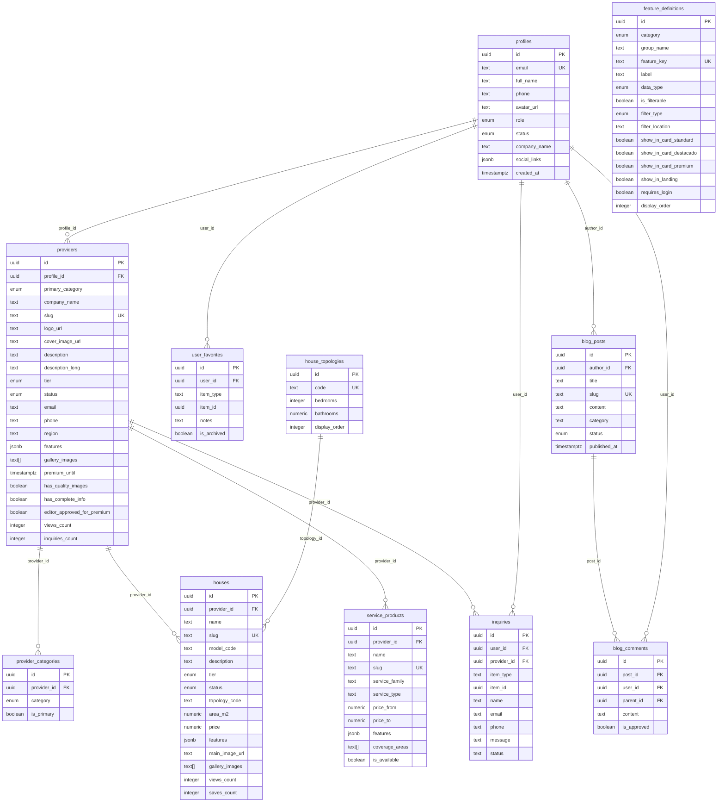
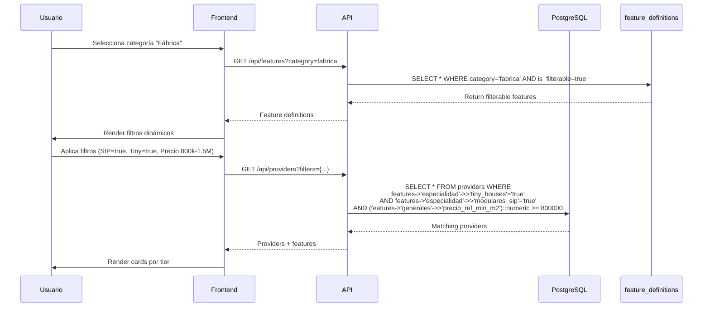
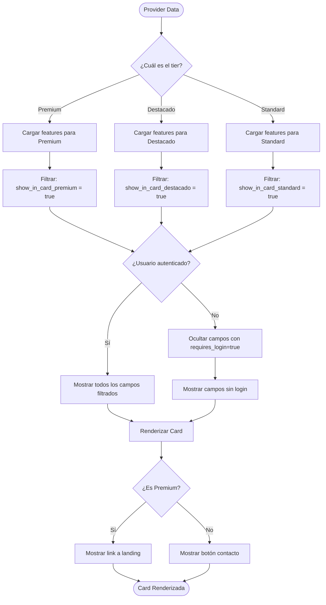
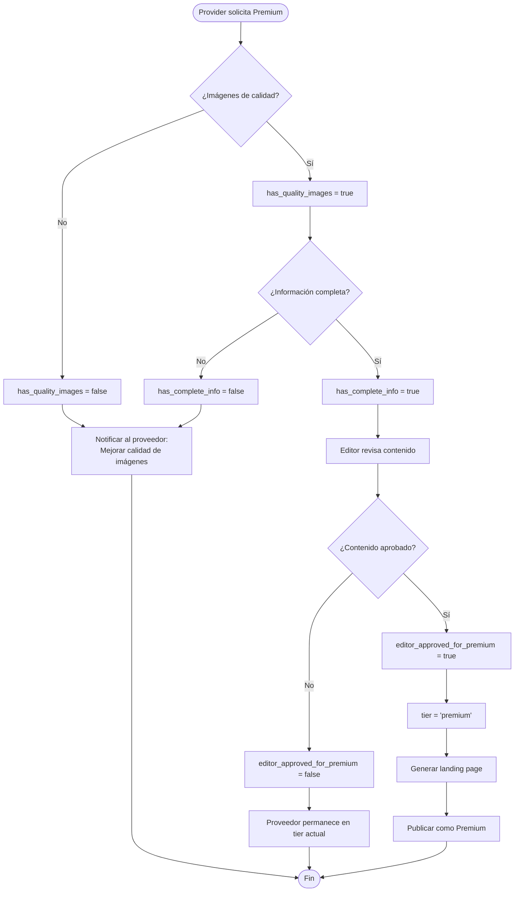
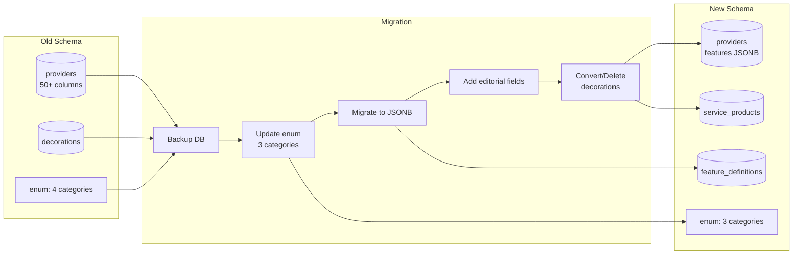
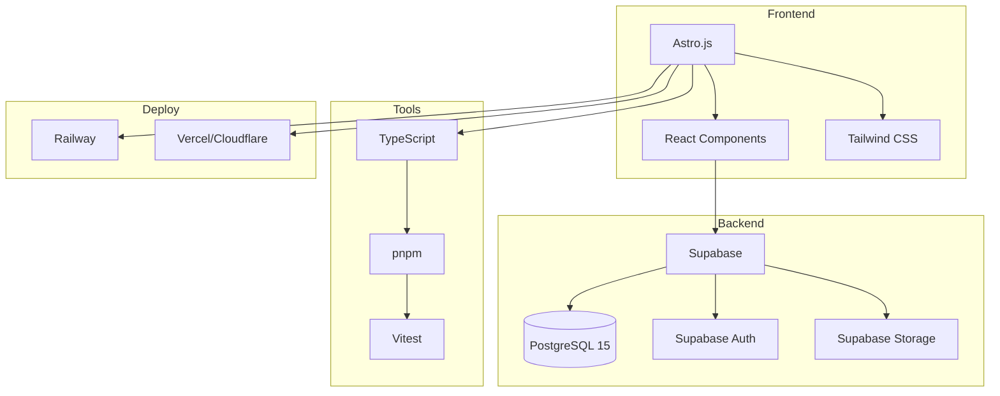
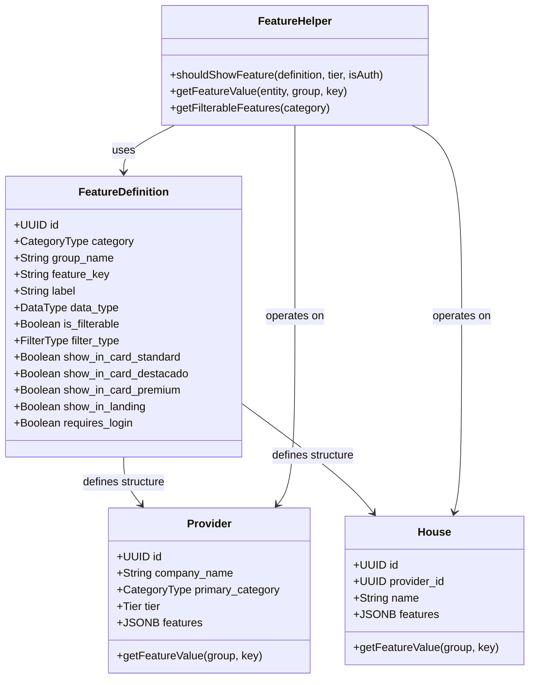

# Diagramas de Arquitectura - MODTOK v2.0

## Diagrama de Base de Datos (ERD)



---

## Flujo de Datos: Búsqueda y Filtrado



---

## Flujo de Renderizado por Tier



---

## Flujo de Control Editorial (Premium)



---

## Arquitectura de Componentes (Frontend)

```mermaid
flowchart TB
    subgraph Pages
        ListPage[/providers/index.astro]
        DetailPage[/provider/[slug].astro]
        AdminPage[/admin/providers/[id].astro]
    end

    subgraph Components
        ProviderCard[ProviderCard.astro]
        FeatureDisplay[FeatureDisplay.tsx]
        FilterSidebar[FilterSidebar.tsx]
        FeatureFormBuilder[FeatureFormBuilder.tsx]
    end

    subgraph Lib
        FeatureHelpers[features.ts]
        SupabaseClient[supabase.ts]
        Types[database.types.ts]
    end

    subgraph Database
        Providers[(providers)]
        Features[(feature_definitions)]
        Houses[(houses)]
    end

    ListPage --> FilterSidebar
    ListPage --> ProviderCard
    DetailPage --> FeatureDisplay
    AdminPage --> FeatureFormBuilder

    ProviderCard --> FeatureHelpers
    FeatureDisplay --> FeatureHelpers
    FilterSidebar --> FeatureHelpers
    FeatureFormBuilder --> FeatureHelpers

    FeatureHelpers --> SupabaseClient
    SupabaseClient --> Types

    SupabaseClient --> Providers
    SupabaseClient --> Features
    SupabaseClient --> Houses
```

---

## Flujo de Migración



---

## Stack Tecnológico



---

## Indexación y Performance

```mermaid
flowchart TD
    Query[User Query] --> Router{Tipo de Consulta}

    Router -->|Por ID| PK[PRIMARY KEY Index<br/>O(1)]
    Router -->|Por Slug| UK[UNIQUE Index<br/>O(log n)]
    Router -->|Por Categoría| Cat[B-tree Index<br/>category]
    Router -->|Por Tier| Tier[B-tree Index<br/>tier]
    Router -->|Por Features| GIN[GIN Index<br/>features JSONB]

    GIN --> JSONBOps[JSONB Operators:<br/>->, ->>, @>, ?]
    JSONBOps --> FastSearch[Búsqueda Rápida<br/>en JSONB]

    PK --> Result[Resultado]
    UK --> Result
    Cat --> Result
    Tier --> Result
    FastSearch --> Result

    Result --> Cache{¿En Cache?}
    Cache -->|Sí| ReturnCache[Return from Cache]
    Cache -->|No| Execute[Execute & Cache]

    ReturnCache --> End([Response])
    Execute --> End
```

---

## Sistema de Features (Metadata Pattern)



---

## Conclusión

Estos diagramas ilustran:

1. **ERD**: Estructura completa de la base de datos
2. **Flujos**: Búsqueda, renderizado, control editorial
3. **Componentes**: Arquitectura del frontend
4. **Migración**: Proceso de transición
5. **Stack**: Tecnologías utilizadas
6. **Performance**: Estrategia de indexación
7. **Metadata Pattern**: Sistema de features dinámicas

Para más detalles, consultar:
- [README.md](./README.md) - Guía principal
- [02_NEW_SCHEMA.sql](./02_NEW_SCHEMA.sql) - Schema completo
- [04_TIER_SYSTEM.md](./04_TIER_SYSTEM.md) - Sistema de tiers
