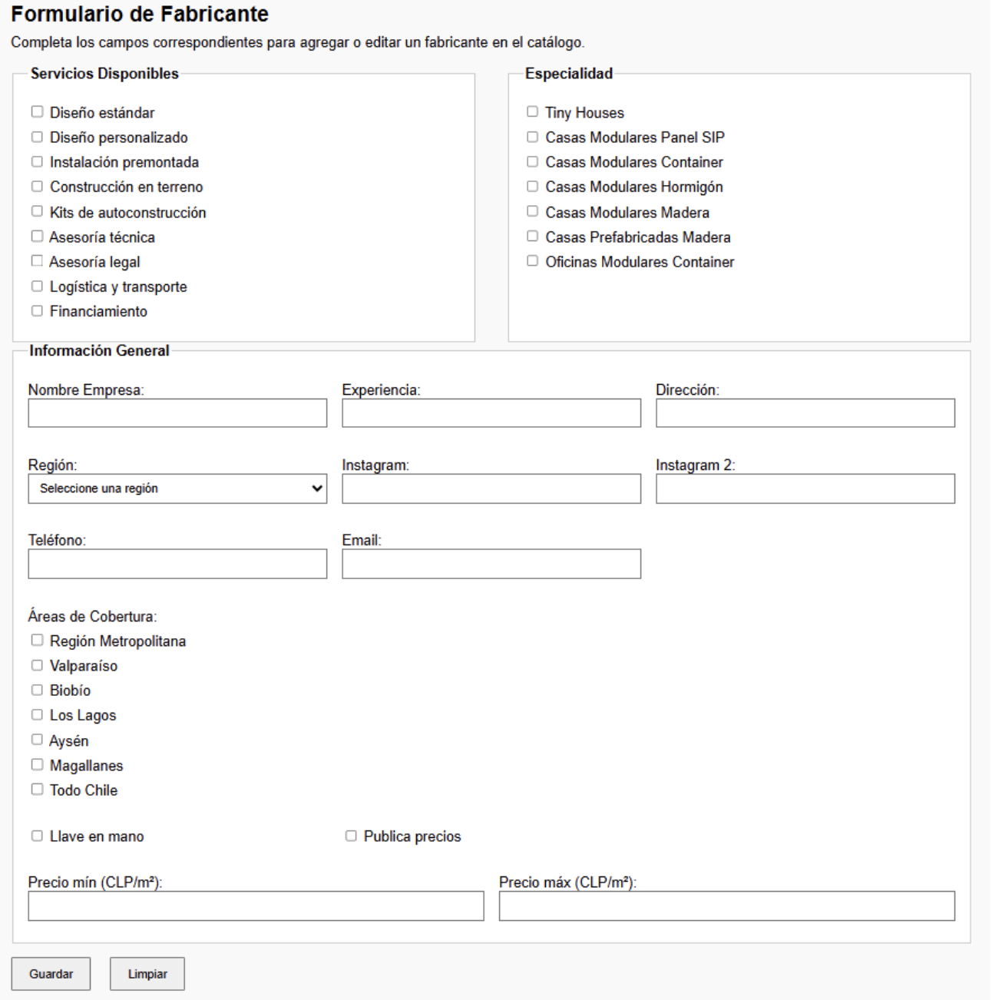
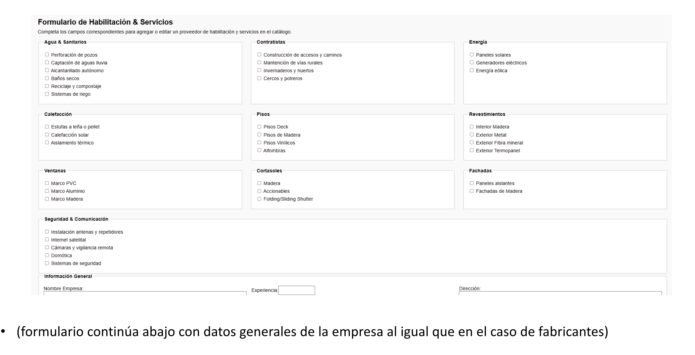

Concepto de dashboard administrador: 10 de 10.
Cambio de etiqueta “Servicios” a “Habilitación” o “H&S”.

Cambios: La mayoría de los campos de fabricantes para etiquetado y filtro son boolean y están agrupados por servicios | especialidad | generales  .

Cambios: La mayoría de los campos de fabricantes para etiquetado y filtro son boolean y están agrupados por servicios | especialidad | generales  .

Bueno, basicamente tenemos que cambiar varias cosillas, lo primero tenemos que cambiar el modelo de datos.

Simplifcar a 3 categorias Fabricas, Casas y habilatacion y servicos
Si va o no va en la tarjeta destacada, en la tarejta de destacada debe ir todo lo de que dice SI.
Premium es la mas cara 

Ok tenemos que hacer varias modificaciones... tenemos que empezar a redicr las categorías a Fabricas, Casas y habilitacion y servicios, y hay que empezar tambien a construir desde ya el CMS. hay que empezar a tomar como prioridad el mantenedor de contenido BLOG y Noticias y las paginas de estas mismas.

necesitamos entender cosas para modelar de nuevo... las fabricas tienen sus propios filtros y las casas necesitan de un fabricante ps. pero ahora tambien hay que tener en cuenta otra cosa! hay que tener en cuenta que fabricantes y casas por si solos tambien se deben capaz de ser el contendio de manera geraquizad, te explico, un proveedor puede pagar un "espacio" premium en el sitio que tendra su propia paginación.

Despues viene los elementos destacados que no tienen tantoe spacio como los premium! la idea es esa y los proveedores pagan por esto! es decir un prvoeedor puede tener su contendi publicado que pueden ser casas, fabricacion y habiltacion y servicios dependiendo del servicio, por ejemplo casas bonitas y cosas así tendran la posibilidad de tener contenido premium o en una sola columa se mostraran dos premium cachai? tiene mas espacio y para los destacados sus 4 por columna. tendran distintos contenido que se mostrara en las cards que aparece en el CVS así que atento con el CVS ya que ahí te dice los filtros y si tiene o no acceso a tarjeta destacada, de todas formas creo es importante que eso sea autoadministrable ya que lo que queremos cuidar como editores del sitios es mostrar contenido bonito por ejemplo si tu servico es de desagues y tienes malas fotos no tienes acceso a premium. la idea es que igual editor tenga super poderes para poder hacerlo premium si considera que el contenido es el adecuado. entonce eso. otra cosa importante es lo que dices en CVS dice landing, claro, las premium tendran una pagina dedicada! y ahí mostraremos mas info y cachai que es un espacio que usaremos checka  mockup/provider/ecomodular.html que es como el mock de una pagina dedicada, OJO QUEES ANTIGUA porque la nueva es en base al ultimo excel. ok importante esto. 

Entonces que requiro? pues varias cosas!

1.- EL modelo de datos nuevo! que haga que esto escale! en base al form que te aparecen en las imagenes que debes analziar, si ves la mayoria son simples check box.
2.- La Lista de tareas para aplicar estos cambios al CMS de factories, servicios eliminar decoraciones y agrregar casas y ver si proveedor nos hace sentido conservar o no + informacion que consideres prudente.
3.- La lista de tareas para trabajar full en que el editor pueda subir noticias + informacion que consideres prudente y es importante que todo el contendio debe ser estatico o lo que sea para que el SEO nos mejore! por favor prioriza esto.
4.- un archivo index para ir trackeando todas las tareas y priorizalas! ya que debemos empezar con las noticias y blog para empezar a ir generando contenido estatico
