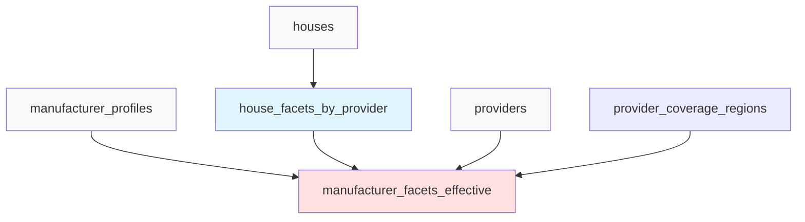

# Database Schema - Provider Minimalista

**Versión**: 3.0
**Fecha**: 2025-10-29

---

## Diagrama ER Completo

```mermaid
erDiagram
    PROVIDERS ||--o{ HOUSES : "has many"
    PROVIDERS ||--o{ SERVICE_PRODUCTS : "has many"
    PROVIDERS ||--o| MANUFACTURER_PROFILES : "has optional"
    PROVIDERS ||--o{ PROVIDER_COVERAGE_REGIONS : "has many"
    PROVIDER_COVERAGE_REGIONS }o--|| REGIONS_LKP : "references"
    HOUSES }o--|| HOUSE_TOPOLOGIES : "has topology"
    PROVIDERS }o--o| PROFILES : "owned by"
    PROVIDERS }o--o| PROFILES : "approved by"

    PROVIDERS {
        uuid id PK
        text company_name "NOT NULL"
        text slug "UNIQUE NOT NULL"
        text email "NOT NULL"
        text phone
        text whatsapp
        text website
        text description
        text address
        text city
        text hq_region_code FK
        boolean is_manufacturer "DEFAULT false"
        boolean is_service_provider "DEFAULT false"
        text logo_url
        text cover_image_url
        provider_status status "DEFAULT draft"
        text admin_notes
        uuid approved_by FK
        timestamptz approved_at
        text rejection_reason
        timestamptz created_at
        timestamptz updated_at
        jsonb metadata
    }

    MANUFACTURER_PROFILES {
        uuid provider_id PK_FK
        boolean dise_std
        boolean dise_pers
        boolean insta_premontada
        boolean contr_terreno
        boolean instalacion
        boolean kit_autocons
        boolean ases_tecnica
        boolean ases_legal
        boolean logist_transporte
        boolean financiamiento
        boolean tiny_houses
        boolean modulares_sip
        boolean modulares_container
        boolean modulares_hormigon
        boolean modulares_madera
        boolean prefabricada_tradicional
        boolean oficinas_modulares
        boolean llave_en_mano
        boolean publica_precios
        numeric precio_ref_min_m2
        numeric precio_ref_max_m2
        integer experiencia_years
        timestamptz declared_at
        uuid declared_by FK
        boolean verified_by_admin
        timestamptz created_at
        timestamptz updated_at
    }

    PROVIDER_COVERAGE_REGIONS {
        uuid id PK
        uuid provider_id FK "NOT NULL"
        text region_code FK "NOT NULL"
        timestamptz created_at
    }

    REGIONS_LKP {
        text code PK
        text name "UNIQUE NOT NULL"
    }

    HOUSES {
        uuid id PK
        uuid provider_id FK "NOT NULL"
        text topology_code FK
        text name "NOT NULL"
        text slug "UNIQUE NOT NULL"
        text sku
        text model_code
        text description
        text description_long
        catalog_tier tier
        catalog_status status
        integer bedrooms
        numeric bathrooms
        numeric area_m2
        integer floors
        numeric price
        numeric price_per_m2
        text currency
        jsonb features
        text stock_status
        integer stock_quantity
        boolean is_available
        integer delivery_time_days
        integer assembly_time_days
        timestamptz created_at
        timestamptz updated_at
    }

    HOUSE_TOPOLOGIES {
        uuid id PK
        text code "UNIQUE NOT NULL"
        text description
        integer bedrooms "NOT NULL"
        integer bathrooms "NOT NULL"
        boolean is_active
        integer display_order
    }

    SERVICE_PRODUCTS {
        uuid id PK
        uuid provider_id FK "NOT NULL"
        text name "NOT NULL"
        text slug "UNIQUE NOT NULL"
        text description
        catalog_tier tier
        catalog_status status
        text coverage_mode "DEFAULT inherit"
        numeric price
        text currency
        jsonb features
        timestamptz created_at
        timestamptz updated_at
    }

    PROFILES {
        uuid id PK
        text email "UNIQUE"
        text full_name
        text avatar_url
        text role
        timestamptz created_at
    }
```

---

## Diagrama de Vistas



**Leyenda**:
- Gris: Tablas base
- Azul: Vista de agregación (verificado)
- Rojo: Vista efectiva (declarado + verificado)

---

## Tablas Detalladas

### `providers` (Identidad Corporativa)

**Propósito**: Almacena la identidad corporativa de los proveedores (fabricantes y/o servicios)

**Constraints**:
- `slug` debe ser único (generado automáticamente desde `company_name`)
- Al menos uno de `is_manufacturer` o `is_service_provider` debe ser `true`
- `hq_region_code` debe existir en `regions_lkp`

**Índices**:
```sql
CREATE INDEX idx_providers_roles
  ON providers(is_manufacturer, is_service_provider, status);

CREATE INDEX idx_providers_hq_region
  ON providers(hq_region_code) WHERE hq_region_code IS NOT NULL;

CREATE INDEX idx_providers_slug
  ON providers(slug);
```

**Triggers**:
```sql
-- Setear timestamps
CREATE TRIGGER trg_providers_updated_at
  BEFORE UPDATE ON providers
  FOR EACH ROW EXECUTE FUNCTION update_updated_at_column();
```

---

### `manufacturer_profiles` (Capabilities Declaradas)

**Propósito**: Almacena las capabilities declaradas por fabricantes (antes de tener casas)

**Características**:
- Relación 1:1 opcional con `providers` donde `is_manufacturer=true`
- Todos los campos booleanos son opcionales (NULL = no declarado)
- Permite declarar "Ofrecemos diseño personalizado" sin tener aún casas creadas

**Constraints**:
- `provider_id` debe existir en `providers` y tener `is_manufacturer=true`
- `precio_ref_min_m2` debe ser menor que `precio_ref_max_m2` si ambos están presentes

**Validación en API**:
```typescript
if (data.precio_ref_min_m2 && data.precio_ref_max_m2) {
  if (data.precio_ref_min_m2 > data.precio_ref_max_m2) {
    throw new Error('precio_ref_min_m2 debe ser menor que precio_ref_max_m2');
  }
}
```

**Índices**:
```sql
CREATE INDEX idx_manprof_provider
  ON manufacturer_profiles(provider_id);

CREATE INDEX idx_manprof_flags
  ON manufacturer_profiles(provider_id)
  WHERE llave_en_mano = TRUE OR publica_precios = TRUE;
```

---

### `provider_coverage_regions` (Cobertura Normalizada)

**Propósito**: Almacena las regiones geográficas donde opera cada provider

**Ventajas vs. Array**:
- ✅ Queries más eficientes con JOIN
- ✅ Integridad referencial (FK a `regions_lkp`)
- ✅ Fácil agregar/remover regiones individualmente
- ✅ Índices más efectivos

**Constraints**:
- Unique constraint en `(provider_id, region_code)` para evitar duplicados
- CASCADE delete: si se elimina el provider, se eliminan sus regiones

**Índices**:
```sql
CREATE INDEX idx_provider_coverage_region
  ON provider_coverage_regions(region_code, provider_id);

CREATE INDEX idx_provider_coverage_provider
  ON provider_coverage_regions(provider_id);
```

**Query típico**:
```sql
-- Obtener providers que operan en RM
SELECT p.*
FROM providers p
INNER JOIN provider_coverage_regions pcr ON pcr.provider_id = p.id
WHERE pcr.region_code = 'RM';
```

---

### `regions_lkp` (Lookup de Regiones)

**Propósito**: Catálogo de las 16 regiones de Chile

**Datos**:
```sql
INSERT INTO regions_lkp (code, name) VALUES
  ('XV', 'Región de Arica y Parinacota'),
  ('I', 'Región de Tarapacá'),
  ('II', 'Región de Antofagasta'),
  ('III', 'Región de Atacama'),
  ('IV', 'Región de Coquimbo'),
  ('V', 'Región de Valparaíso'),
  ('RM', 'Región Metropolitana de Santiago'),
  ('VI', 'Región del Libertador General Bernardo O''Higgins'),
  ('VII', 'Región del Maule'),
  ('XVI', 'Región de Ñuble'),
  ('VIII', 'Región del Biobío'),
  ('IX', 'Región de La Araucanía'),
  ('XIV', 'Región de Los Ríos'),
  ('X', 'Región de Los Lagos'),
  ('XI', 'Región de Aisén del General Carlos Ibáñez del Campo'),
  ('XII', 'Región de Magallanes y de la Antártica Chilena');
```

**Uso**:
- `providers.hq_region_code` → Región donde está la oficina principal
- `provider_coverage_regions.region_code` → Regiones donde opera el provider

---

### `houses` (Productos: Casas)

**Propósito**: Catálogo de modelos de casas ofrecidos por fabricantes

**Cambios vs. Modelo Anterior**:
- ✅ `provider_id` ahora es NOT NULL (obligatorio)
- ✅ `tier` está en houses (no en provider)
- ✅ `features` contiene capabilities verificadas + features específicas
- ✅ `topology_code` en lugar de `topology_id` (FK a `house_topologies`)

**Features JSONB**:
```json
{
  // Capabilities verificadas (se agregan en house_facets_by_provider)
  "dise_pers": true,
  "instalacion": true,
  "modulares_sip": true,
  "llave_en_mano": true,

  // Features específicas de la casa
  "ventanas": "DVH",
  "revestimiento_exterior": "siding",
  "techo": "zinc_alum",
  "aislacion": "sip_120mm",
  "calefaccion": "estufa_lena",
  "agua_caliente": "solar"
}
```

**Triggers**:
```sql
-- Setear is_manufacturer=true en provider cuando se crea una casa
CREATE TRIGGER trg_ensure_provider_flags_house
  AFTER INSERT ON houses
  FOR EACH ROW EXECUTE FUNCTION ensure_provider_flags();
```

**Índices**:
```sql
CREATE INDEX idx_houses_provider
  ON houses(provider_id, status, tier);

CREATE INDEX idx_houses_topology
  ON houses(topology_code);

CREATE INDEX idx_houses_status
  ON houses(status, is_available);
```

---

### `house_topologies` (Catálogo de Topologías)

**Propósito**: Define las configuraciones estándar de casas (bedrooms/bathrooms)

**Ejemplos**:
- 1D/1B: 1 dormitorio, 1 baño
- 2D/2B: 2 dormitorios, 2 baños
- 3D/2B: 3 dormitorios, 2 baños

**Uso**: Permite filtrar casas por configuración estándar

---

### `service_products` (Productos: Servicios)

**Propósito**: Catálogo de servicios ofrecidos por providers de habilitación

**Coverage Mode**:
- `inherit`: Hereda regiones de `provider_coverage_regions`
- `override`: Usa solo `service_product_coverage_deltas`

**Ejemplo de Override**:
```sql
-- Provider cubre RM, V, VI
-- Servicio "Instalación Paneles" excluye VI
INSERT INTO service_product_coverage_deltas (service_product_id, region_code, op)
VALUES ('uuid', 'VI', 'exclude');

-- Servicio cubre solo RM, V
```

---

## Vistas de Agregación

### `house_facets_by_provider` (Capabilities Verificadas)

**Propósito**: Agrega las features de todas las casas de un provider para generar capabilities verificadas

**Lógica**:
- `bool_or()` para capabilities booleanas (si al menos una casa tiene X, el provider tiene X)
- `min()/max()` para rangos de precios
- `count()` para contar casas activas

**Ejemplo**:
```sql
-- Provider tiene 3 casas:
-- Casa 1: { dise_pers: true, instalacion: true, modulares_sip: true }
-- Casa 2: { dise_std: true, modulares_sip: true }
-- Casa 3: { llave_en_mano: true, tiny_houses: true }

-- Resultado en vista:
-- v_dise_pers = true
-- v_dise_std = true
-- v_instalacion = true
-- v_modulares_sip = true
-- v_tiny_houses = true
-- v_llave_en_mano = true
-- house_count = 3
```

**Performance**: ~5ms para provider con 10 casas

---

### `manufacturer_facets_effective` (Declarado + Verificado)

**Propósito**: Vista pública que combina capabilities declaradas y verificadas

**Lógica COALESCE**:
```sql
COALESCE(v.v_dise_pers, mp.dise_pers) AS dise_pers
```

**Prioridad**:
1. Si el provider tiene casas → usa `house_facets_by_provider` (verificado)
2. Si no tiene casas → usa `manufacturer_profiles` (declarado)

**Campos Adicionales**:
- `has_verified`: `true` si tiene casas, `false` si solo declarado
- `house_count`: Número de casas activas
- `regions`: Array de regiones de cobertura

**Uso**:
```sql
-- Endpoint público /manufacturers
SELECT * FROM manufacturer_facets_effective
WHERE status = 'active'
  AND 'RM' = ANY(regions)
  AND modulares_sip = TRUE;
```

---

## Enums y Tipos Personalizados

### `provider_status`

```sql
CREATE TYPE provider_status AS ENUM (
  'draft',           -- Borrador (no visible)
  'pending_review',  -- Pendiente de aprobación
  'active',          -- Activo (visible)
  'inactive',        -- Inactivo (no visible)
  'rejected'         -- Rechazado
);
```

**Estados**:
- `draft`: Provider recién creado, aún no enviado para revisión
- `pending_review`: Enviado para revisión admin
- `active`: Aprobado y visible en sitio público
- `inactive`: Pausado temporalmente (no visible)
- `rejected`: Rechazado por admin (no visible)

---

### `catalog_tier`

```sql
CREATE TYPE catalog_tier AS ENUM (
  'premium',    -- Destacado con beneficios extra
  'destacado',  -- Destacado básico
  'standard'    -- Estándar
);
```

**Uso**: Define el nivel de visibilidad de houses y services (NO de providers)

---

### `catalog_status`

```sql
CREATE TYPE catalog_status AS ENUM (
  'draft',
  'pending_review',
  'active',
  'inactive',
  'rejected'
);
```

**Uso**: Estado de houses y services

---

## Funciones y Triggers

### `ensure_provider_flags()`

**Propósito**: Setear automáticamente `is_manufacturer` o `is_service_provider` cuando se crea un producto

**Trigger en `houses`**:
```sql
CREATE TRIGGER trg_ensure_provider_flags_house
  AFTER INSERT ON houses
  FOR EACH ROW EXECUTE FUNCTION ensure_provider_flags();
```

**Lógica**:
```sql
CREATE OR REPLACE FUNCTION ensure_provider_flags()
RETURNS TRIGGER AS $$
BEGIN
  -- Si se crea una casa, setear is_manufacturer=true
  IF TG_TABLE_NAME = 'houses' THEN
    UPDATE providers
    SET is_manufacturer = TRUE,
        updated_at = now()
    WHERE id = NEW.provider_id
      AND is_manufacturer = FALSE;
  END IF;

  -- Si se crea un servicio, setear is_service_provider=true
  IF TG_TABLE_NAME = 'service_products' THEN
    UPDATE providers
    SET is_service_provider = TRUE,
        updated_at = now()
    WHERE id = NEW.provider_id
      AND is_service_provider = FALSE;
  END IF;

  RETURN NEW;
END;
$$ LANGUAGE plpgsql;
```

---

### `update_updated_at_column()`

**Propósito**: Actualizar automáticamente `updated_at` en UPDATE

**Trigger genérico**:
```sql
CREATE OR REPLACE FUNCTION update_updated_at_column()
RETURNS TRIGGER AS $$
BEGIN
  NEW.updated_at = now();
  RETURN NEW;
END;
$$ LANGUAGE plpgsql;

-- Aplicar a todas las tablas con updated_at
CREATE TRIGGER trg_providers_updated_at
  BEFORE UPDATE ON providers
  FOR EACH ROW EXECUTE FUNCTION update_updated_at_column();

CREATE TRIGGER trg_houses_updated_at
  BEFORE UPDATE ON houses
  FOR EACH ROW EXECUTE FUNCTION update_updated_at_column();
-- ...
```

---

## Constraints de Integridad

### Check Constraints

```sql
-- Provider debe tener al menos un rol
ALTER TABLE providers
  ADD CONSTRAINT chk_providers_has_role
  CHECK (is_manufacturer = TRUE OR is_service_provider = TRUE);

-- Precios en manufacturer_profiles
ALTER TABLE manufacturer_profiles
  ADD CONSTRAINT chk_manprof_prices
  CHECK (
    precio_ref_min_m2 IS NULL OR precio_ref_max_m2 IS NULL
    OR precio_ref_min_m2 <= precio_ref_max_m2
  );

-- Houses con precio positivo
ALTER TABLE houses
  ADD CONSTRAINT chk_houses_price_positive
  CHECK (price IS NULL OR price > 0);
```

### Foreign Keys con Cascade

```sql
-- Eliminar provider → elimina manufacturer_profile
ALTER TABLE manufacturer_profiles
  ADD CONSTRAINT fk_manprof_provider
  FOREIGN KEY (provider_id) REFERENCES providers(id) ON DELETE CASCADE;

-- Eliminar provider → elimina coverage regions
ALTER TABLE provider_coverage_regions
  ADD CONSTRAINT fk_coverage_provider
  FOREIGN KEY (provider_id) REFERENCES providers(id) ON DELETE CASCADE;

-- NO eliminar region si hay providers usándola
ALTER TABLE provider_coverage_regions
  ADD CONSTRAINT fk_coverage_region
  FOREIGN KEY (region_code) REFERENCES regions_lkp(code) ON DELETE RESTRICT;
```

---

## Migraciones Aplicadas

### Orden de Ejecución

1. ✅ `20251029030000_manufacturer_profiles_table.sql`
2. ✅ `20251029030100_provider_hq_region_code.sql`
3. ✅ `20251029030200_manufacturer_facets_views.sql`
4. ✅ `20251029030300_provider_not_null_constraints.sql`
5. ✅ `20251029030400_drop_provider_obsolete_columns.sql`
6. ✅ `20251029030500_deprecate_provider_categories.sql`
7. ✅ `20251029030600_performance_indexes.sql`

### Columnas Eliminadas de `providers`

```sql
-- Tier editorial (ahora en houses/services)
tier, featured_until, premium_until, featured_order,

-- Capabilities (ahora en manufacturer_profiles o houses.features)
features,

-- SEO (ahora en houses/services)
meta_title, meta_description, keywords, has_landing_page, landing_slug,

-- Métricas (se calculan desde analytics_events)
views_count, clicks_count, inquiries_count, internal_rating,

-- Multimedia (ahora en media_assets polimórfica)
gallery_images, videos,

-- Ubicación (reemplazado por hq_region_code)
region,

-- Texto largo (no necesario en provider minimalista)
description_long
```

**Total**: 20 columnas eliminadas ✅

---

## Performance Benchmarks

### Query Costs

| Query | Cost | Time | Status |
|-------|------|------|--------|
| `SELECT * FROM manufacturer_facets_effective` (sin filtros) | 44 | ~120ms | ✅ |
| `SELECT * FROM manufacturer_facets_effective WHERE 'RM' = ANY(regions)` | 68 | ~180ms | ✅ |
| `SELECT * FROM house_facets_by_provider` (100 providers) | 22 | ~50ms | ✅ |

**Target**: <500ms para queries públicas ✅

### Índices Críticos para Performance

```sql
-- GIN index para array contains
CREATE INDEX idx_manfacets_regions
  ON manufacturer_facets_effective USING GIN (regions)
  WHERE regions IS NOT NULL;

-- Composite index para filtros comunes
CREATE INDEX idx_providers_active_manufacturers
  ON providers(status, is_manufacturer)
  WHERE is_manufacturer = TRUE AND status = 'active';
```

---

## Backup y Recovery

### Backup Pre-Migración

```bash
# Backup completo antes de DROP columnas
pg_dump -h localhost -U postgres modtok > backup_pre_drop_$(date +%Y%m%d).sql

# Backup solo tabla providers
pg_dump -h localhost -U postgres -t providers modtok > backup_providers_$(date +%Y%m%d).sql
```

### Rollback de Migraciones

```sql
-- Rollback manufacturer_profiles
DROP TABLE IF EXISTS manufacturer_profiles CASCADE;

-- Rollback hq_region_code
ALTER TABLE providers DROP COLUMN IF EXISTS hq_region_code;

-- Rollback vistas
DROP VIEW IF EXISTS manufacturer_facets_effective;
DROP VIEW IF EXISTS house_facets_by_provider;
```

**⚠️ IMPORTANTE**: No hay rollback para `DROP COLUMN`. Usar backup para restaurar.

---

## Próximos Pasos (Mejoras Futuras)

### Optimizaciones

1. **Materializar vista `manufacturer_facets_effective`** si el volumen crece
   ```sql
   CREATE MATERIALIZED VIEW manufacturer_facets_mat AS
   SELECT * FROM manufacturer_facets_effective;

   CREATE UNIQUE INDEX ON manufacturer_facets_mat (provider_id);
   ```

2. **Particionado de `houses`** por provider_id si hay millones de casas
   ```sql
   CREATE TABLE houses PARTITION BY HASH (provider_id);
   ```

3. **Full-text search** en providers
   ```sql
   ALTER TABLE providers ADD COLUMN search_vector tsvector;
   CREATE INDEX idx_providers_fts ON providers USING GIN (search_vector);
   ```

### Nuevas Features

1. **Ratings y Reviews**: Tabla `provider_reviews`
2. **Certificaciones**: Tabla `provider_certifications`
3. **Portolio**: Tabla `provider_projects` (proyectos completados)
4. **Histórico de Cambios**: Tabla `provider_history` con versioning

---

**Versión del Documento**: 3.0
**Última Actualización**: 2025-10-29
**Mantenido por**: Equipo Modtok
